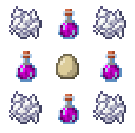

# MobEssence
Everything living has a life force, it's what makes them what they are. We call it essence, and if
we're able to extract it as they die, then it can be distilled and injected into an egg so they may
once again walk the earth.

### Attaining Essence
When a mob dies, it has a chance to drop its essence. This chance is configurable and defaults
to every 1 in 256 mobs.

### Infusing Essence into Eggs
A method of infusing chicken eggs with essence has come to light. In the center of your workbench,
you place the chicken egg. In the immediately surrounding squares is where you place your essence.
The last four spots left are for the bone meal for the essence to cultivate. You can see this below.

### Configuration
There is one configuration option, `drop-chance`.

`drop-chance` is the inverse of the value you provide. So if you change it to 100 then there is a 
1 in 100 chance a mob will drop its essence on death. This value defaults to `256`.

You can view the default configuration [here](src/main/resources/config.yml).
